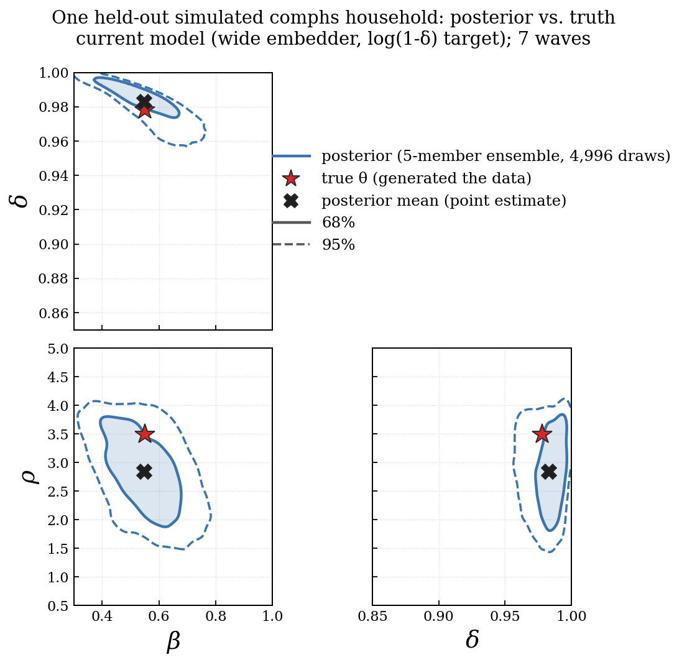
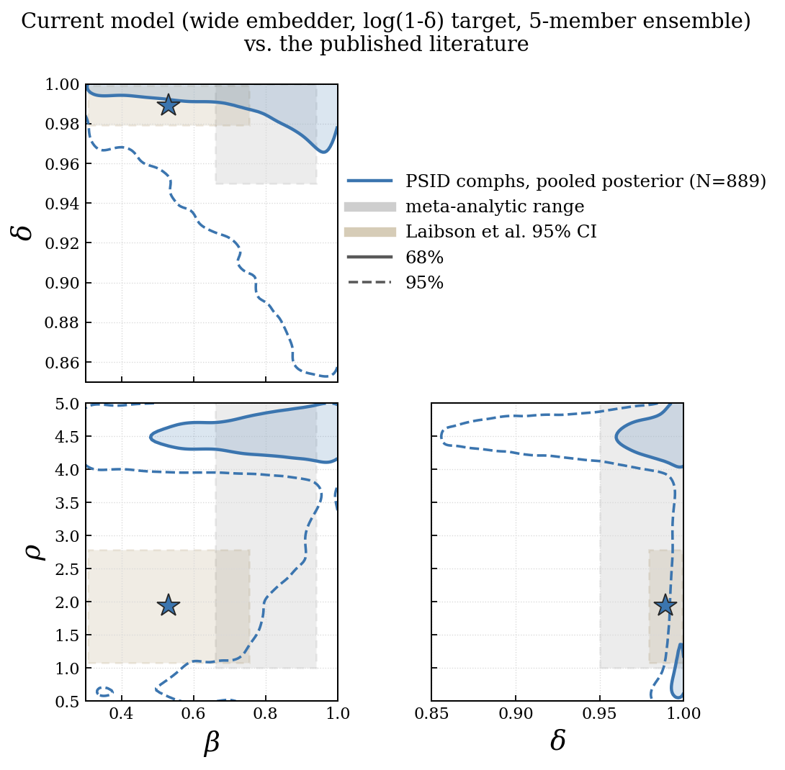

# Household-level preference estimation from PSID — summary for review

*Prepared 2026-09-26. Detailed record: `RESULTS.md` (section numbers below refer to it).*

## What the project does

Laibson, Lee, Maxted, Repetto & Tobacman estimate **one** set of preference
parameters for the US population — present bias β, long-run discount factor δ,
and risk aversion ρ — by fitting their two-asset lifecycle model to SCF moments
(simulated method of moments).

This project estimates a **posterior distribution over (β, δ, ρ) for each
household** in a 7-wave PSID panel (2011–2023), using the same structural model.
The estimator is **neural posterior estimation** (NPE): simulate the model at
many parameter values, train a neural network to map a household's observed
trajectory (income, consumption, liquid wealth, illiquid wealth, age in each
wave) to a posterior over its parameters, then apply it to real households.

The data differ from Laibson et al.'s — PSID panel with consumption versus SCF
cross-section without it — so different estimates are expected and are not by
themselves evidence of error.

**Current model.** Transformer summary network (width 128, 3 layers, 64-number
summary) feeding a neural-spline normalising flow; δ estimated as
`log(1 − δ)` so the posterior cannot put mass at or above 1; five independently
trained networks averaged (ensemble). Trained on 65,536 simulated parameter draws
× 8 households each; results below are for high-school-complete households
(`comphs`, 889 in PSID) unless stated.

---

## 1. Training: is the model trained well?

Evaluated on simulated households the network never saw, where the true
parameters are known.

### Calibration — are the uncertainty statements honest?

Simulation-based calibration (SBC, Talts et al. 2018): for 335 fresh
simulations, check how often the true parameter falls inside the stated 90%
credible interval. A well-calibrated posterior covers 90% of the time.

```
                      90% coverage    rank-uniformity test (p)
beta                     0.896              0.21
delta                    0.842              0.007   <- under-covers
rho                      0.899              0.17
```

β and ρ are essentially exactly calibrated. **δ under-covers**: its intervals are
somewhat too narrow, and the rank test rejects uniformity. This is the cost of
the `log(1 − δ)` parameterisation (§20.3): it removes an artefact at δ = 1 on
real data but makes δ harder for the network to represent across the whole prior
range. The binomial standard error of these coverage figures is ±0.016.

### Choices behind the configuration (§19)

Each change was tested against a matched baseline, five seeds each:

```
                           held-out log q   mean |coverage - 0.90|
Phase 4 baseline                5.095              0.027
+ wider summary network         5.130              0.015
+ log(1 - delta) target           —                0.021   (log q not comparable)
```

- Enlarging the **flow** (the density part) made every metric worse — it
  over-fits. Enlarging the **summary network** improved every metric: the
  bottleneck was how much of each household's trajectory reached the flow.
- A learning curve (train on 1/4, 1/2, all of the data) shows each doubling of
  simulations buys half the gain of the previous one; another doubling (~10 GPU
  days) would add about as much as the summary-network change, which was free.
- Training converges in 64–85 epochs out of 200 (early stopping on a held-out
  validation set grouped by simulated household).

---

## 2. Forecasting simulated households: can it recover parameters?

Held-out simulated `comphs` households, true parameters known. Average over five
networks:

```
               correlation(true, estimate)   mean abs error   no-model error*
beta                    0.79                      0.094            0.175
delta                   0.79                      0.020            0.038
rho                     0.86                      0.411            1.125
```

\* Error from always guessing the middle of the prior range. The model removes
roughly half the error for β and δ and two thirds for ρ.

### One household in detail



`figures/10_simulated_household_posterior.png` — one held-out simulated
household. Chosen by rule, not by eye: among 162 households whose true values
are away from the prior edges, the one with the **median** estimation error.
Shaded region = 68% credible region, dashed = 95%; red star = true parameters;
black cross = posterior mean (the point estimate).

```
          true    estimate    90% interval          covers truth
beta     0.551     0.548      [0.405, 0.700]         yes
delta    0.978     0.983      [0.964, 0.994]         yes
rho      3.496     2.835      [1.903, 3.723]         yes
```

What the figure shows: β and δ are pinned down well; **β and δ trade off**
against each other (the tilted region — more patience in one can substitute for
the other); ρ is the least precise, and its point estimate is off by 0.66 but
the truth is still inside the interval.

---

## 3. Application to PSID

### Headline (889 comphs households)

```
                          beta      delta      rho
median household         0.840     0.994     4.454
spread across households 0.099     0.023     0.889

Laibson et al. (population) 0.531  0.989     1.936
```



`figures/08` — each household's posterior mean summarised as 68%/95% regions,
against published ranges (grey) and Laibson et al.'s estimate (star, tan box =
their 95% interval).

### Comparison with the literature

Laibson et al.'s number is a representative-agent fit to population moments, so
the primary benchmark is the published range of estimates:

| | our median | published range | households inside |
|---|---|---|---|
| β | 0.840 | 0.66–0.94 (convex-time-budget meta-analyses; Imai et al. pooled 0.82) | 90.7% |
| δ | 0.994 | 0.95–1.00 (Carroll et al., heterogeneous discount factors) | 89.3% |
| ρ | 4.45 | 1–7 (Elminejad et al.: ≈1 in consumption studies, 2–7 in finance) | 99.8% |

- **β = 0.84 agrees with the experimental literature.** Laibson et al.'s 0.53 is
  below it.
- **δ agrees** with both Laibson et al. and Carroll et al.
- **ρ = 4.45 is the weak result.** It is only inside the range because finance
  estimates reach 7; consumption-based estimates are near 1. Separate checks
  (§15, §18) show the model cannot match PSID's wealth levels and its
  consumption comovement at the same time, and ρ absorbs that misfit — wealth
  alone implies ρ ≈ 4.6, consumption alone ρ ≈ 1.

### Do households actually differ?

The central question for a household-level method. Spread in household
estimates is not evidence by itself — noisy estimates of one common value also
spread. The test subtracts estimation noise:
`true variance = variance of household estimates − average posterior variance`,
bootstrapped over households. A negative value means **no detectable
differences**.

```
                 comphs (889)        somehs (211)        compco (527)
beta             none  (P=1.00)      none  (P=1.00)      none  (P=1.00)
delta            yes, sd 0.014       yes, sd 0.019       none  (P=0.99)
rho              not identified — see below
```

- **β: no detectable heterogeneity**, in every group and every model variant
  tried. Households' present bias cannot be told apart with this data.
- **δ: small, real differences** in comphs and somehs (1.4–1.9 percentage points
  in the annual discount factor), close to Carroll et al.'s ~2 points. **Not in
  compco**, whose households sit tightly at δ ≈ 0.998.
- **ρ: not identified.** Across three reasonable model variants its estimated
  heterogeneity is strongly positive, absent, and strongly positive again, with
  non-overlapping intervals. It tracks modelling choices, not households.

### Education groups

| | N | median β | median δ | median ρ | all three inside published ranges |
|---|---|---|---|---|---|
| comphs | 889 | 0.840 | 0.994 | 4.45 | 82.7% |
| somehs | 211 | 0.808 | 0.975 | 4.70 | 67.3% |
| compco | 527 | 0.797 | 0.998 | 4.17 | 78.2% |

Figures `11_somehs_full…`, `13_compco_full…` (current model) and
`12_somehs_arch…`, `14_compco_arch…` (without the `log(1 − δ)` change), each
against that group's earlier baseline. Only comphs is directly comparable to
Laibson et al., whose sample is high-school complete.

---

## Honest assessment

**Defensible now**
- The method works and is well calibrated on simulated data (β, ρ exactly; δ
  somewhat over-confident).
- Population-level β and δ are consistent with the published literature.
- A clear negative finding: **no detectable household heterogeneity in present
  bias.** This bears directly on the premise of estimating β per household.
- Small but real heterogeneity in δ for two of three education groups.

**Not yet defensible**
- That the model predicts an *individual* household's β or ρ. For δ, about 36%
  of the spread across comphs household estimates is real signal; for β, none.
- That ρ ≈ 4.5 is a genuine risk-aversion estimate rather than the model
  absorbing its own misfit.

**Main limitation.** The structural model does not reproduce PSID's wealth and
consumption-comovement patterns at any parameter value (misses by ~2×). The
posteriors are "best fit within a misspecified model".

---

## In progress and planned

1. **Out-of-sample forecast test (running).** Estimate each household's
   parameters from waves 1–5 only, forecast its consumption and wealth in waves
   6–7, and compare against one population parameter set, Laibson et al.'s, and
   "nothing changes". This directly tests whether household-specific parameters
   carry predictive information.
2. **Quasi-hyperbolic vs exponential discounting (planned, §21).** Train a second
   model with β fixed at 1 and compare out-of-sample forecasts, an amortised
   model-comparison classifier, and fit to PSID moments. Needs ~2.5 GPU-days of
   new simulation. Preliminary: 95% of households' β intervals do not exclude 1.

## Questions for discussion

1. Given no detectable β heterogeneity, should the paper's contribution be
   framed around the **population** estimate and the δ distribution, with the β
   null as a result in its own right?
2. How to treat ρ: report with the misspecification caveat, or constrain it
   (e.g., fix ρ from the consumption literature) and re-estimate β and δ?
3. Is the out-of-sample forecast test the right standard for "household
   parameters are useful", or is there a benchmark the field would expect?
4. Worth pursuing model fixes (income left tail, wealth moments) before the
   exponential-discounting comparison, or after?
